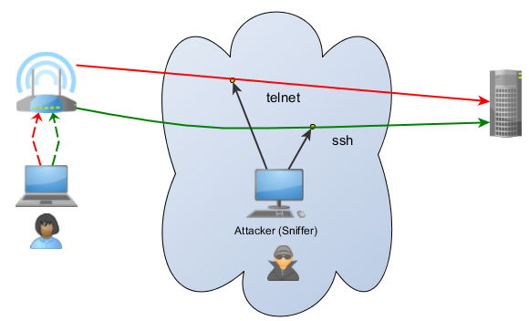
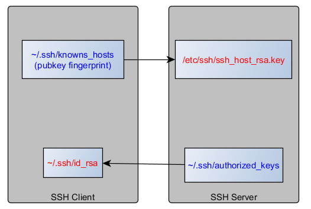
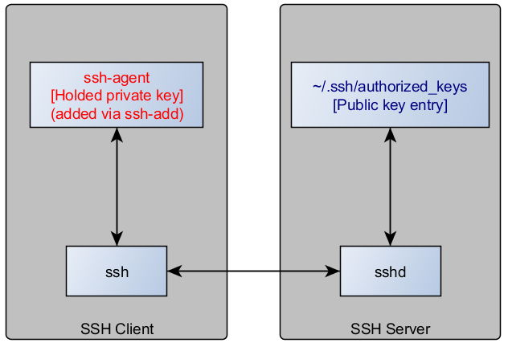
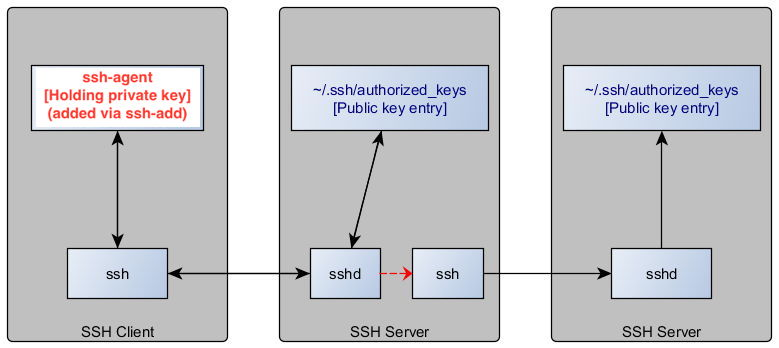
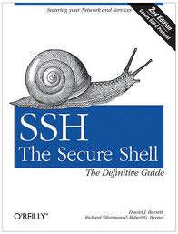
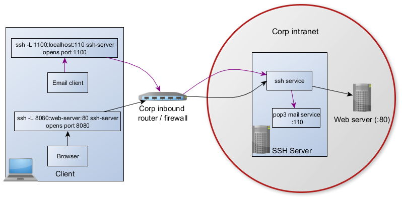
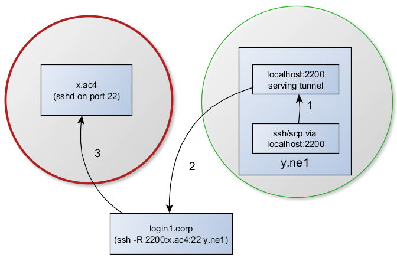
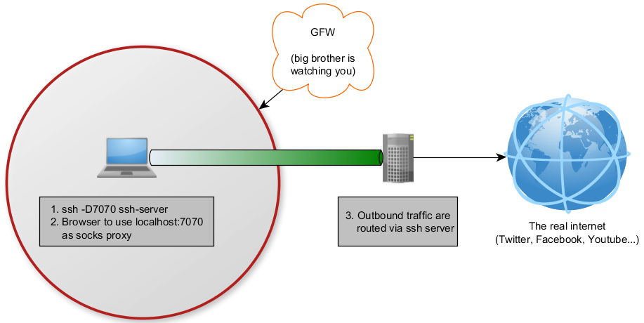

class: center, middle

# SSH Essential


Matthew Wang

<small>
Last updated: May 22, 2016<br>
[github.com/ymattw/ssh-essential](https://github.com/ymattw/ssh-essential)
</small>

---

# Outline

- Overview
- Basic usage
- Public key authentication
- SSH agent
- Troubleshooting
- Advanced: port forwarding
- Appendix

---

class: center, middle

## Overview

Concept, typical usage, clients

---

### Concept

- Secure SHell, replaces telnet and rsh
- A network protocol for secure data communication
- <a href="http://www.openssh.org">OpenSSH</a> is the most popular implementation
- Client-server model over TCP (default port 22)

---

### Typical usage

- Remote shell services or command execution
- Secure data communication over an insecure network



---

### Clients

- OpenSSH: ssh, scp, sftp, ssh-keygen, ssh-agent, ssh-add
- PuTTY (putty, plink, pscp, psftp, puttygen, pageant), **offcial site**:
  <a href="http://www.chiark.greenend.org.uk/~sgtatham/putty/download.html">www.chiark.greenend.org.uk/~sgtatham/putty/download.html</a>
- SecureCRT
- XShell

---

class: center, middle

## Basic usage

Basic commands, known hosts, client side configuration

---

### Basic usage: ssh

- ssh user@example.org
- ssh -l user example.org
- ssh example.org
- ssh example.org cat /etc/hosts
- ssh example.org "hostname; cat /etc/hosts"
- ssh -t example.org tmux attach

---

### Basic usage: scp

- scp localFile user@example.org:remotePath
- scp user@example.org:remoteFile localPath
- scp -r localDir example.org:
- scp -o port=2222 example.org:remoteFile .

---

### Basic usage: sftp

<pre>
localhost:~ $ <b>sftp login.example.org</b>
Connecting to login.example.org...
Password:
sftp&gt; <b>ls</b>
HOMEBACKUP          HOSTS           foo.example.org
error2.log          success.log     tf-tunnel.sh
sftp&gt; <b>get error2.log</b>
Fetching /home/ymattw/error2.log to error2.log
/home/ymattw/error2.log 100% 1902KB 100.1KB/s   00:19
sftp&gt; <b>mput H*</b>
Uploading HOSTS to /home/ymattw/HOSTS
HOSTS                          100%   31     0.0KB/s   00:00
sftp&gt; <b>help</b>
...
sftp&gt; <b>exit</b>
localhost:~ $
</pre>

---

### Known hosts

The prompt at first time connection

<pre>
$ ssh -l ymattw example.org
The authenticity of host 'example.org (192.168.0.2)' can't be established.
RSA key fingerprint is 77:a5:69:81:9b:eb:40:76:7b:13:04:a9:6c:f4:9c:5d.
Are you sure you want to continue connecting (<span class="red">yes/no</span>)?

Warning: Permanently added 'example.org,192.168.0.2' (RSA) to the list of
known hosts
</pre>

Skip the prompt: `ssh -o BatchMode=yes`

---

### Known hosts

The warning

<pre>
@@@@@@@@@@@@@@@@@@@@@@@@@@@@@@@@@@@@@@@@@@@@@@@@@@@@@@@@@@@
@    WARNING: REMOTE HOST IDENTIFICATION HAS CHANGED!     @
@@@@@@@@@@@@@@@@@@@@@@@@@@@@@@@@@@@@@@@@@@@@@@@@@@@@@@@@@@@
IT IS POSSIBLE THAT SOMEONE IS DOING SOMETHING NASTY!
Someone could be eavesdropping on you right now (man-in-the-middle attack)!
It is also possible that the RSA host key has just been changed.
The fingerprint for the RSA key sent by the remote host is
77:a5:69:81:9b:eb:40:76:7b:13:04:a9:6c:f4:9c:5d.
Please contact your system administrator.
Add correct host key in /home/ymattw/.ssh/known_hosts to get rid of this
message.
<span class="red">Offending key in /home/ymattw/.ssh/known_hosts:36</span>
</pre>

<p>Sometimes:</p>

<pre>Offending key in <span class="red">/etc/ssh/known_hosts:36</span></pre>

<p>Igore the warning: <code>ssh -o StrictHostKeyChecking=no</code></p>

---

### Client side configuration

Save command line options to ~/.ssh/config

```
  Host e
      Hostname example.org
      User ymattw

  Host foo.*
      StrictHostKeyChecking no
```

To see all options: `man ssh_config`

---

class: center, middle

<h2>Public key authentication</h2>
<p>Concept, generate key pair, setup key</p>

---

<h3>Concept of public key authentication</h3>
<ul>
  <li><span class="navy">public</span> key for <span class="navy">encryption </span>, and</li>
  <li><span class="red">private</span> key for <span class="red">decryption</span></li>
  <li>Messages are encrypted with the recipient's public key, and</li>
  <li>can be decrypted only with the corresponding private key</li>
</ul>


---

<h3>Generate key pair</h3>
<ul>
  <li>ssh-keygen [-t rsa | dsa] [-f key]
  <pre>
% ssh-keygen
Generating public/private rsa key pair.
Enter file in which to save the key (/home/ymattw/.ssh/id_rsa):
Enter passphrase (empty for no passphrase):
Enter same passphrase again:
Your identification has been saved in /home/ymattw/.ssh/id_rsa.
Your public key has been saved in /home/ymattw/.ssh/id_rsa.pub.
The key fingerprint is:
ff:1a:11:a6:a1:30:09:77:a8:23:2b:9e:ac:59:5c:9a ymattw@cent7
...
% l ~/.ssh/id_rsa*
-rw------- 1 ymattw wheel 1675 Jan  1 19:15 /home/ymattw/.ssh/id_rsa
-rw-r--r-- 1 ymattw wheel  394 Jan  1 19:15 /home/ymattw/.ssh/id_rsa.pub
  </pre>
  </li>
  <!-- DSA is faster at signing, RSA is faster at verifying -->
  <li>Default filename: ~/.ssh/id_rsa, ~/.ssh/id_dsa</li>
  <li>The passphrase</li>
  <li>Tip: dump public key<br>
  <pre>ssh-keygen -y -f key</pre></li>
</ul>

---

<h3>Setup key</h3>
<ul>
  <li><span class="red">Append <b>public</b> key</span> to
  <u>~/.ssh/authorized_keys</u> on remote host, or use <code>ssh-copy-id id_rsa
  user@remote_host</code></li>
  <li>The ownership and permission bits (minimal)<pre>
(Both sides)
drwxr-xr-x 39 ymattw users 4096 Mar  6 23:17 /home/ymattw/
drwx------  2 ymattw users 4096 Mar  2 15:32 /home/ymattw/.ssh/

(Client side)
-rw-------  1 ymattw users  951 Jul 29  2011 /home/ymattw/.ssh/ymattw.key

(Server side)
-rw-------  1 ymattw users  951 Jul 29  2011 /home/ymattw/.ssh/authorized_keys
</pre>
  </li>
  <li>Use key in client side: <code>ssh -i ~/.ssh/ymattw.key</code></li>
  <li>In ~/.ssh/config:
  <pre>
Host github.com
    User git
    IdentityFile ~/.ssh/ymattw.key
  </pre>
  </li>
</ul>

---

<h3>Use OpenSSH private key with PuTTY</h3>


---

class: center, middle

<h2>SSH agent</h2>
<p>Concept, using ssh-agent, agent forwarding</p>

---

<h3>Concept of ssh agent</h3>


---

<h3>Using ssh-agent</h3>
<p>ssh-agent daemonize itself and output a bunch of environment variables</p>
<ol>
  <li>Invoke a ssh-agent process
  <ul>
    <li>ssh-agent bash, or</li>
    <li>eval $(ssh-agent), or</li>
    <li>ssh-agent &gt; .agent.rc; source .agent.rc</li>
  </ul>
  </li>
  <li>Add key: ssh-add ~/.ssh/ymattw.key</li>
  <li>List key: ssh-add -l</li>
  <li>ssh login.example.org</li>
</ol>
<p>The secret</p>
<pre>
localhost:~ $ <b>echo $SSH_AGENT_PID</b>
19177
localhost:~ $ <b>echo $SSH_AUTH_SOCK</b>
/tmp/ssh-QQtcq19176/agent.19176
localhost:~ $ <b>ls -l $SSH_AUTH_SOCK</b>
<span class="red">s</span>rw------- 1 ymattw users 0 Mar 19 13:46 /tmp/ssh-QQtcq19176/agent.19176
localhost:~ $
</pre>

---

<h3>Agent forwarding</h3>
<pre>
ssh -A
(ssh -o ForwardAgent=yes)
</pre>


---

<h3>SSH agent in PuTTY</h3>

<p>Run <b>pageant.exe</b> and add your private key (imported openssh key)</p>

---

class: center, middle

<h2>Troubleshooting</h2>
<p>Tips, FAQ, where to get help</p>

---

<h3>Troubleshooting tips</h3>
<ul>
  <li>Login problem
  <ul>
    <li>ssh -v -v</li>
    <li>check ownership and permission bits</li>
    <li>/var/log/secure, /var/log/message, /var/log/auth.log</li>
    <li>Is that a newly created user still in 'locked' state? (password not set)</li>
  </ul>
  </li>
  <li>SSH agent problem
  <ul>
    <li>"Error reading response length from authentication socket"</li>
    <li>check <code>$SSH_AUTH_SOCK</code></li>
    <li>ssh-add -l</li>
  </ul>
  </li>
</ul>

---

<h3>My favorite FAQ</h3>
<p><code>ssh remote "myscript.sh &amp;"</code> just <span class="red">hang</span></p>
<ul>
  <li>POC: ssh foo.example.org "/bin/sleep 5 &amp;"</li>
  <li>It does not "hang", it is waiting for stdin/stdout/stderr as
  they are bound to the connection socket</li>
</ul>

<p>Solution: redirect stdin/stdout/stderr, e.g:
&lt; /dev/null &gt; run.log 2&gt; &amp;1</p>

<p>Similar: ssh remote myscipt.sh "hang" upon completion when it run
other process in background with stdin/stdout/stderr open</p>

<a href="http://www.openssh.org/faq.html#3.10">OpenSSH FAQ 3.10 - Hangs when exiting ssh</a>

---

<h3>Where to get help</h3>
<ul>
  <li>man ssh, man ssh-keygen, man ssh_config, etc.</li>
  <li>Search the web</li>
  <li>"SSH, The Secure Shell: The Definitive Guide"</li>
</ul>


---

class: center, middle

<h2>Advanced: port forwarding</h2>
<p>Local/remote/dynamic port forwarding (tunneling)</p>

---

<h3>Local port forwarding</h3>


---

<h3>Remote port forwarding</h3>


---

<h3>Dynamic port forwarding</h3>


---

<h3>Port forward only</h3>
<p>ssh -f -N</p>
<pre>
-f      Requests ssh to go to background just before command execution.
        This is useful if ssh is going to ask for passwords or
        passphrases, but the user wants it in the background.

-N      Do not execute a remote command.  This is useful for just for-
        warding ports (protocol version 2 only).
</pre>

---

class: center, middle

<h2>Appendix</h2>
<p>Other implementations</p>

---

<h3>Other SSH implementations</h3>
<ul>
  <li><a href="https://matt.ucc.asn.au/dropbear/dropbear.html">Dropbear</a>: Lightweight SSH server/client for embedded systems</li>
  <li><a href="http://www.lag.net/paramiko/">paramiko</a>: SSH2 implementation written entirely in python</li>
  <li><a href="http://www.lag.net/jaramiko/">jaramiko</a>: Java port of paramiko</li>
  <li><a href="http://www.jcraft.com/jsch/">JSch - Java Secure Channel</a>: a pure Java implementation of SSH2</li>
  <li><a href="http://www.vandyke.com/">SecureCRT</a>: Mluti tabbed SSH client, support Z-modem file transfer</li>
  <li><a href="http://en.poderosa.org/">Poderosa</a>: tabbed terminal emulator (SSH client) for Windows</li>
  <li><a href="http://sourceforge.net/projects/winscp/">WinSCP</a>: Graphical sftp client for Windows</li>
</ul>
